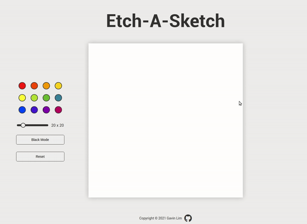

# The Odin Project: Etch-A-Sketch

Implementation of the Etch-A-Sketch project from The Odin Project [curriculum](https://www.theodinproject.com/)

[Live Demo](http://gavinslim.com/odin-etch-a-sketch/) :point_left:

**Features:**
- Webpage with 16x16 grid of square divs
- Grid divs change color when passed over, leaving a pixelated trail through your grid like a pen would
- User is able to reset the grid to a blank slate
- User is able to select a specific color
- User is able to change the resolution of the grid

---

**Rainbow and black color**

**Changing grid resolution**

**Color selection palette**

**Things I learned**
- Generating a dynamic grid based on user input
- Creating multiple buttons within a grid
- Slider initialization
